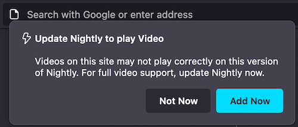
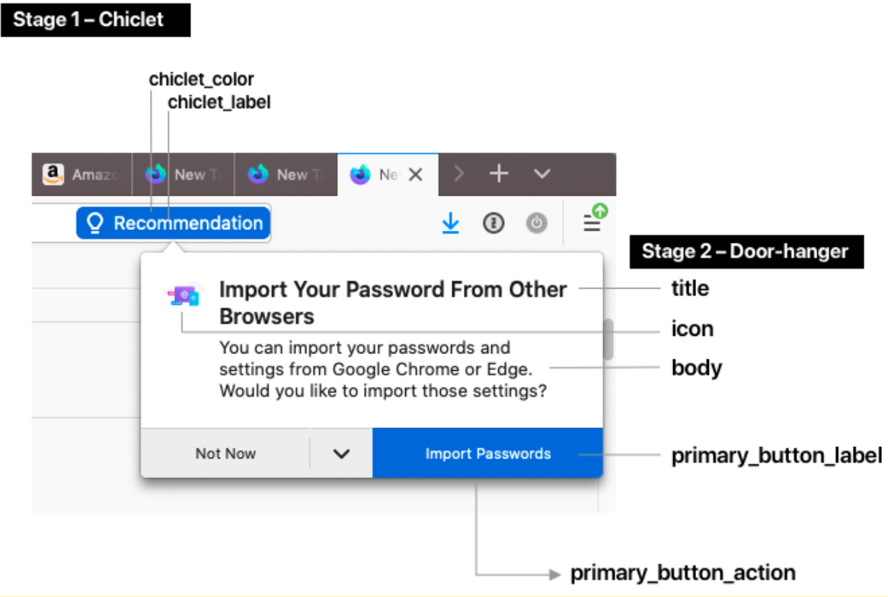

# Contextual Feature Recommendation

## What are CFRs?
CFR  Messaging Surface is the doorhanger, which anchors to one of the UI elements such as the application menu, the identity panel and so on.
CFRs like any other messaging screen has specific triggers. You can learn more about triggers [here](https://firefox-source-docs.mozilla.org/toolkit/components/messaging-system/docs/TriggerActionSchemas/index.html).

[More examples of templates supported with CFR](https://experimenter.info/messaging/desktop-messaging-surfaces/#doorhanger)

### Note:
For new messages, [Feature Callout](./feature-callout.md) is recommended instead of CFR.

### Example of Doorhanger


## Testing CFRs

### Via the dev tools:
1. Go to `about:config`, set pref `browser.newtabpage.activity-stream.asrouter.devtoolsEnabled` to `true`
2. Open a new tab and go to `about:asrouter` in the url bar
3. In devtools Messages section, select and show messages from `cfr` as provider
4. You should see example JSON messages with `"template": "cfr_doorhanger"` or `"template": "milestone_message"`. Clicking `Show` next to CFR message should show respective message UI
5. You can directly modify the message in the text area with your changes or by pasting your custom message JSON. Clicking `Modify` shows your new updated CFR message.
6. Ensure that all required properties are covered according to the [Doorhanger Schema](https://searchfox.org/mozilla-central/source/browser/components/asrouter/content-src/templates/CFR/templates/ExtensionDoorhanger.schema.json)
7. Clicking `Share`, copies link to clipboard that can be pasted in the url bar to preview doorhanger UI in browser and can be shared to get feedback from your team.
- **Note:** Some messages will not be shown when testing multiple CFRs due to overlap, ensure you close the previous message before testing another

- **Note:** The `"anchor_id"` prop is the ID of the element the CFR will attach to (example below: `tracking-protection-icon-box`). Setting prop skip_address_bar_notifier to true will show the doorhanger straight away skipping url bar notifier (See [Bug 1831198](https://bugzilla.mozilla.org/show_bug.cgi?id=1831198)).

### Via Experiments:
You can test CFR messaging surface by creating an experiment or landing message in tree. [Messaging Journey](https://experimenter.info/messaging/desktop-messaging-journey) captures creating and testing experiments via Nimbus.

### Example JSON for CFR
```
{
  "id": "Test_CFR",
  "groups": [
    "cfr"
  ],
  "template": "cfr_doorhanger",
  "content": {
    "persistent_doorhanger": true,
    "anchor_id": "tracking-protection-icon-container",
    "layout": "icon_and_message",
    "icon": "chrome://activity-stream/content/data/content/assets/glyph-webextension-16.svg",
    "icon_dark_theme": "chrome://activity-stream/content/data/content/assets/glyph-webextension-16.svg",
    "icon_class": "cfr-doorhanger-small-icon",
    "heading_text": "Update Nightly to play Video",
    "text": "Videos on this site may not play correctly on this version of Nightly. For full video support, update Nightly now.",
    "buttons": {
      "primary": {
        "label": {
          "string_id": "cfr-doorhanger-extension-ok-button"
        },
        "action": {
          "type": "OPEN_PREFERENCES_PAGE",
          "data": {
            "category": "sync",
            "entrypoint": "cfr-test"
          }
        }
      },
      "secondary": [
        {
          "label": {
            "string_id": "cfr-doorhanger-extension-cancel-button"
          },
          "action": {
            "type": "CANCEL"
          }
        }
      ]
    },
    "skip_address_bar_notifier": true
  },
  "frequency": {
    "lifetime": 1
  },
  "trigger": {
    "id": "nthTabClosed"
  },
  "targeting": "firefoxVersion >= 115"
}
```
Legacy Simple CFR Template
--------------------

The “Simple CFR Template” is a two-stage UI (a chiclet notification and a door-hanger)
that shows up on a configurable trigger condition, such as when the user visits a particular web page.

To test specific Test Messages with legacy CFR templates in the tree, follow these steps:

1. Go to `about:config`, set pref `browser.newtabpage.activity-stream.asrouter.devtoolsEnabled` to `true`
2. Set pref `browser.newtabpage.activity-stream.asrouter.providers.cfrlocal` to `{"id":"cfrlocal","type":"local","localProvider":"CFRMessageProvider","enabled":true,"exclude":[]}`
3. Open a new tab and go to `about:asrouter#devtools` in the url bar
3. In devtools Messages section, under Filters show messages from `cfrlocal` as provider
4. You should see example JSON messages with `"template": "cfr_doorhanger"` or `"template": "cfr_urlbar_chiclet"`. Clicking `Show` next to CFR message should show respective message UI



## Doorhanger Configuration

### Stage 1 – Chiclet

* **chiclet_label**: The text that shows up in the chiclet. 20 characters max.
* **chiclet_color**: The background color of the chiclet as a HEX code.


### Stage 2 – Door-hanger

* **title**: Title text at the top of the door hanger.
* **body**: A longer paragraph of text.
* **icon**: An image (please provide a URL or the image file up to 96x96px).
* **primary_button_label**: The label of the button.
* **primary_button_action**: The special action triggered by clicking on the button. Choose any of the available [button actions](https://firefox-source-docs.mozilla.org/toolkit/components/messaging-system/docs/SpecialMessageActionSchemas/index.html). Common examples include opening a section of about:preferences, or opening a URL.
